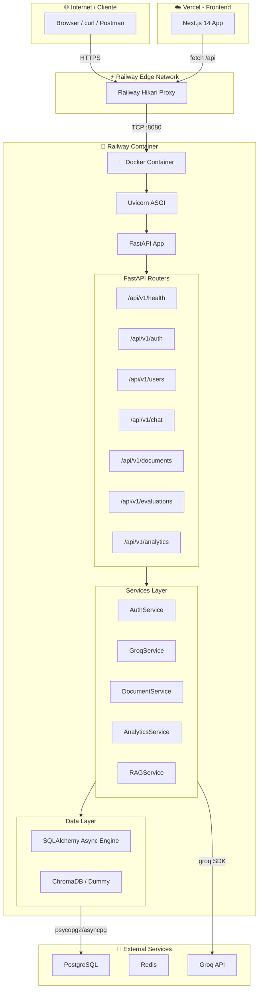
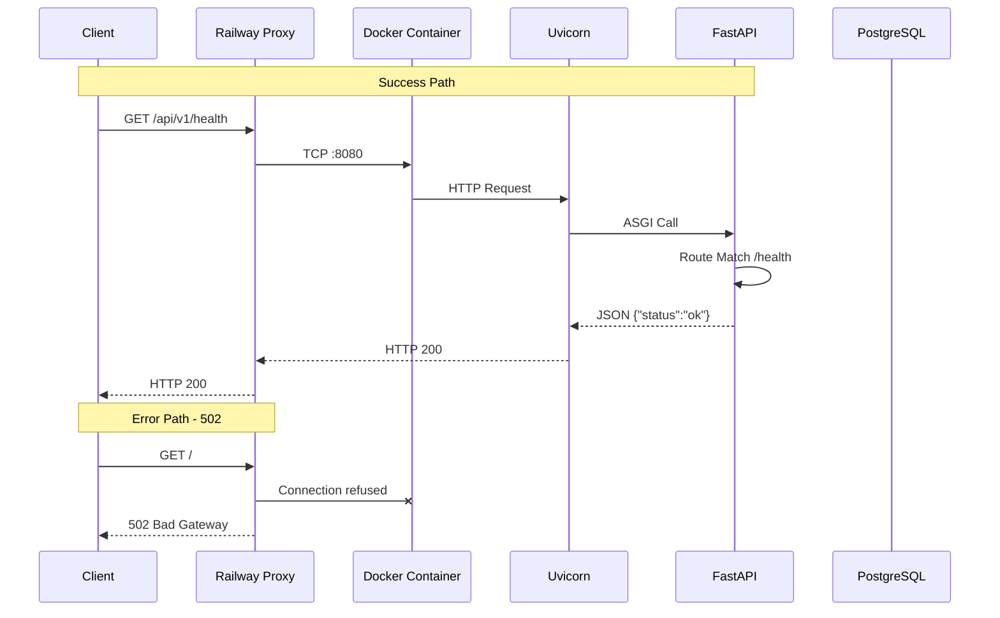

# C3PO Architecture - Análisis Completo

## Diagrama de Flujo I/O



## Flujo de Request/Response



## Endpoints del API

| Método | Endpoint | Descripción | Auth |
|--------|----------|-------------|------|
| GET | `/` | Root | No |
| GET | `/api/v1/health` | Health check | No |
| POST | `/api/v1/auth/register` | Registrar tenant | No |
| POST | `/api/v1/auth/login` | Login | No |
| GET | `/api/v1/users/me` | Usuario actual | JWT |
| POST | `/api/v1/chat` | Nuevo chat | JWT |
| GET | `/api/v1/documents` | Listar docs | JWT |
| POST | `/api/v1/evaluations/{id}/submit` | Submit eval | JWT |
| GET | `/api/v1/analytics/overview` | Analytics | JWT |

## Diagnóstico de Errores

| Código | Significado | Causa | Solución |
|--------|-------------|-------|----------|
| 502 | Bad Gateway | Container no responde | Ver logs, rebuild |
| 503 | Service Unavailable | RuntimeError startup | Configurar env vars |
| 500 | Internal Error | Exception en código | Revisar logs |

## Estado Actual

```
URL: https://c3po-production-0c24.up.railway.app
Status: 502 Bad Gateway
Error: "Application failed to respond"
Logs: Ver Console en Railway Dashboard
```

### Posibles Causas del 502

1. **Build fallando** - Dependencies no instaladas
2. **Container crash** - Exception al iniciar
3. **Wrong port** - App escuchando en puerto incorrecto
4. **Health check fail** - Railway mata el contenedor

### Solución Recomendada

1. Railway Dashboard → Deployments
2. Redeploy con "Clear Build Cache"
3. Ver logs del Console durante build
