# ReDrive Edu - Architecture

## System Architecture

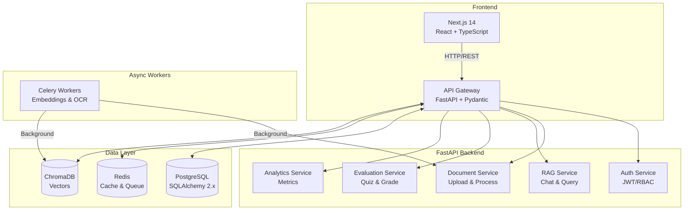

## Multi-Tenant Architecture

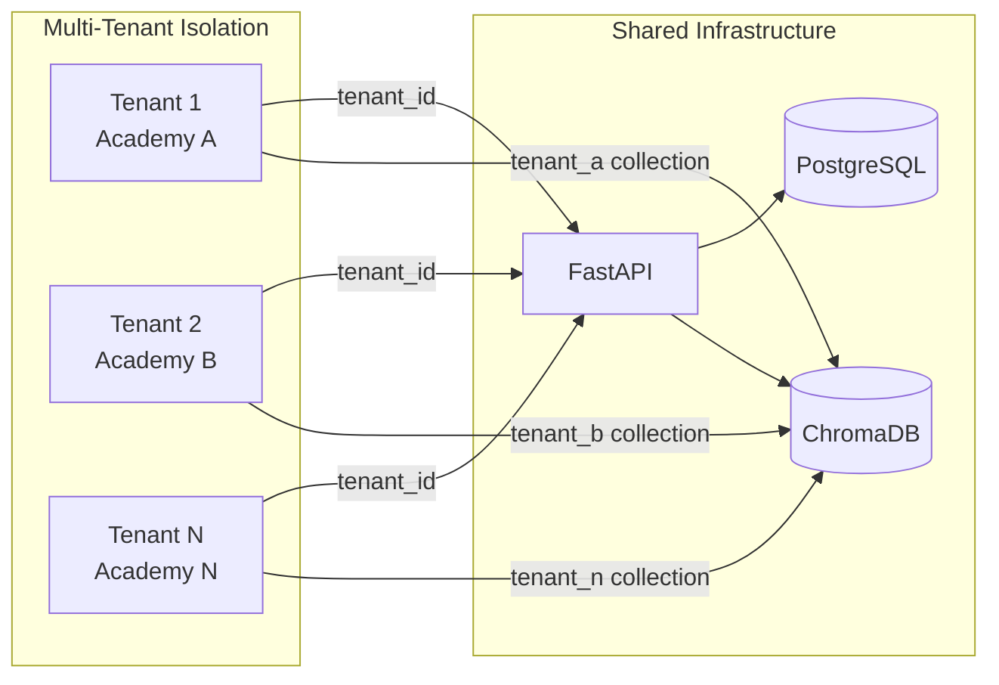

## Document Processing Pipeline

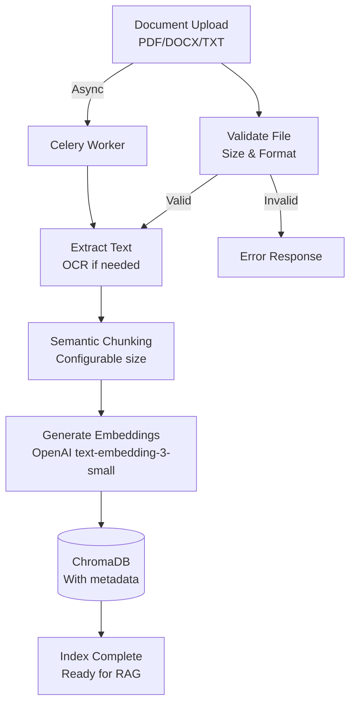

## RAG Query Flow

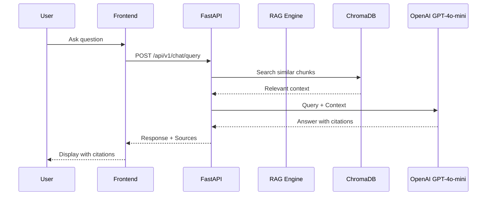

## User Roles & Permissions

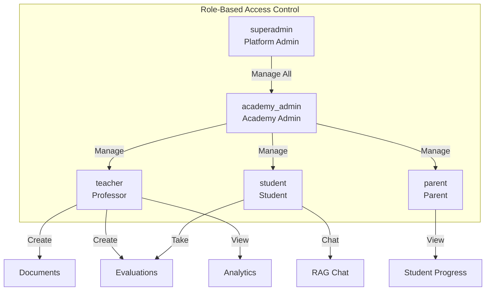

## Deployment Architecture

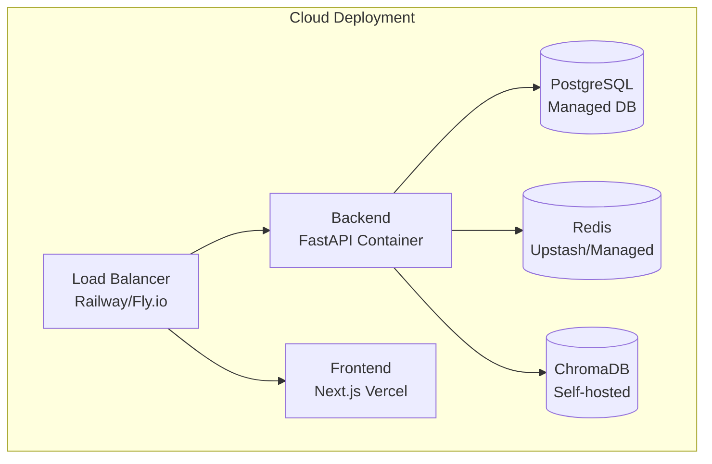

## Database Schema

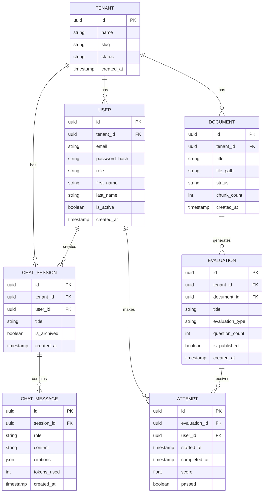

## API Authentication Flow

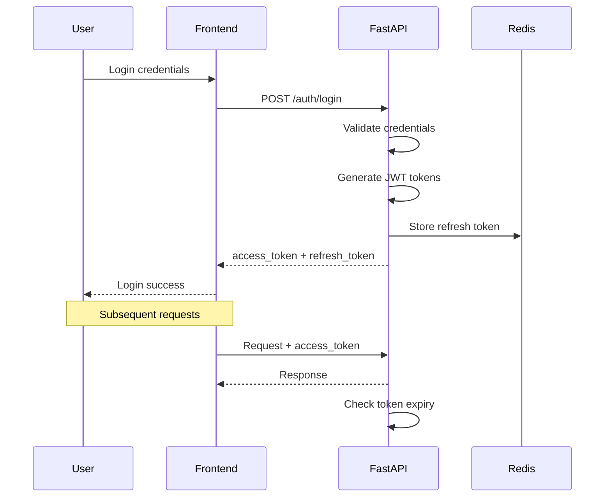

## Technology Stack

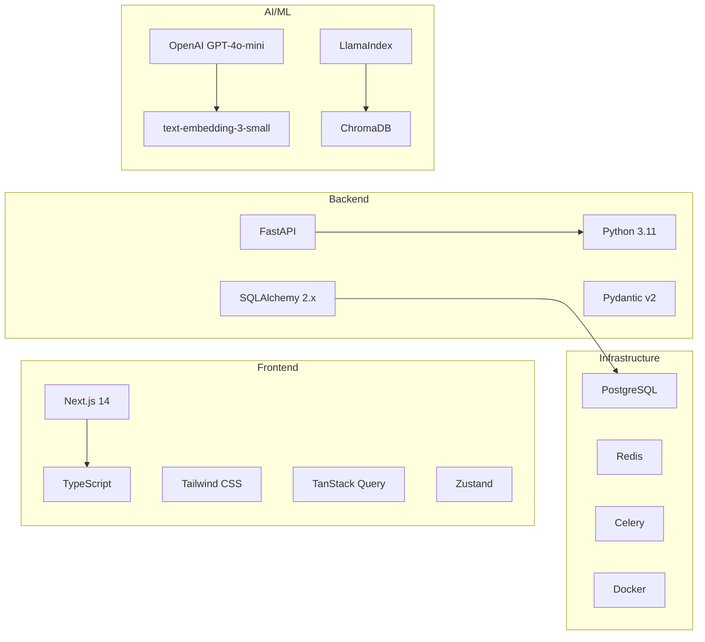

## Performance Metrics

```mermaid
gantt
    title Request Latency Targets
    dateFormat X
    axisFormat %s

    section API
    Simple API call :0, 300
    RAG Query (no streaming) :0, 2000
    RAG Streaming start :0, 500

    section Processing
    50-page PDF processing :0, 30000
    Embedding generation :0, 5000
```

## Monitoring & Observability

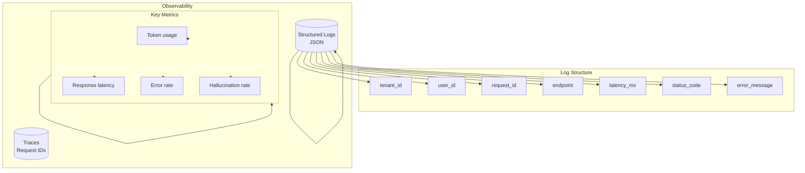